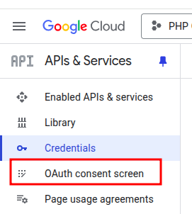
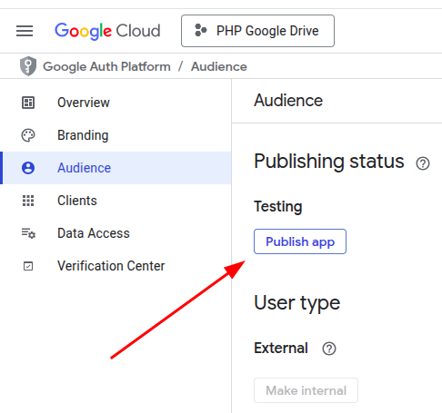
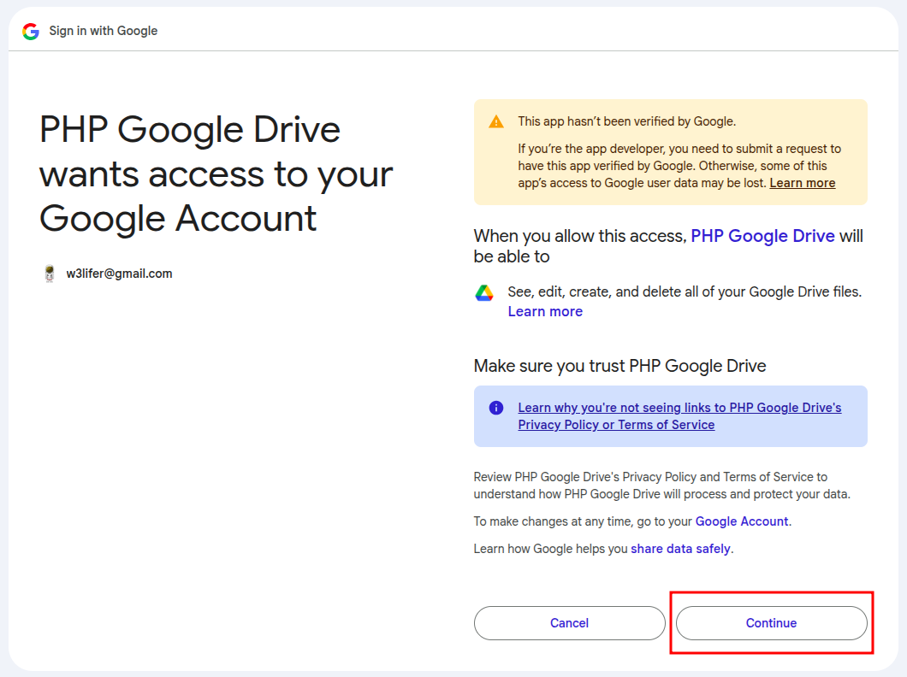

# [php-google-drive](https://packagist.org/packages/w3lifer/php-google-drive)

- [Installation](#installation)
- [Usage](#usage)
- [How to get Google Drive API credentials](#how-to-get-google-drive-api-credentials)
  - [Create a new project](#create-a-new-project)
  - [Enable Google Drive API](#enable-google-drive-api)
  - [Create credentials](#create-credentials)
  - [Publish app](#publish-app)
- [How to get a token](#how-to-get-a-token)
- [Tests](#tests)

## Installation

``` sh
composer require w3lifer/php-google-drive
```

## Usage

``` php
<?php

// require_once __DIR__ . '/vendor/autoload.php';

use w3lifer\Google\Drive;

$googleDrive = new Drive([
    'pathToCredentials' => __DIR__ . '/credentials.json', // Required
    'pathToToken' => __DIR__ . '/token.json', // Required
]);

$fileId = $googleDrive->upload(
    __DIR__ . '/hello.txt',  // Required
    [ // Optional
        '<folder id>',
        '<folder id>',
    ]
);
```

- Folder ID: `https://drive.google.com/drive/folders/<folder-id>`

## How to get Google Drive API credentials

### Create a new project

---

- https://console.cloud.google.com

> 

> 

---

### Enable Google Drive API

---

> 

> 

> 

> 

---

### Create credentials

---

> 

<ins>If you left the screen above, go to "Enable API & services" and click "Google Drive API":</ins>

> 

> 

> 

> 

> 

> 

---

### Publish app

---

> 

## How to get a token

**1. Save the credential to disk and specify the path to them by setting the `pathToCredentials` configuration key**

``` php
$googleDrive = new Drive([
    'pathToCredentials' => __DIR__ . '/credentials.json', // Required
    'pathToToken' => __DIR__ . '/token.json', // Required
]);
```

> **Note** that `pathToToken` is the path where the `Drive` saves the token after the first run. That is, the token will be saved automatically along the specified path; it is needed for your application to subsequently access Google Drive without the consent screen.

---

**2. Run your app**

- You will receive the following message in the console:

```
Open the following link in your browser:
https://accounts.google.com/o/oauth2/v2/auth?...
Enter verification code:
```

- Open the link in the message and choose desired account:



- The warning "Google hasn't verified this app" may appear. Click "Advanced" and then "Go to ... (unsafe)":


- On the next screen click "Continue":


- After the redirect, copy the code from the address bar of your browser and paste it in the console:



```
Open the following link in your browser:
https://accounts.google.com/o/oauth2/v2/auth?...
Enter verification code: <here>
```

**3. Enjoy!**

## Tests

``` sh
make tests
```
